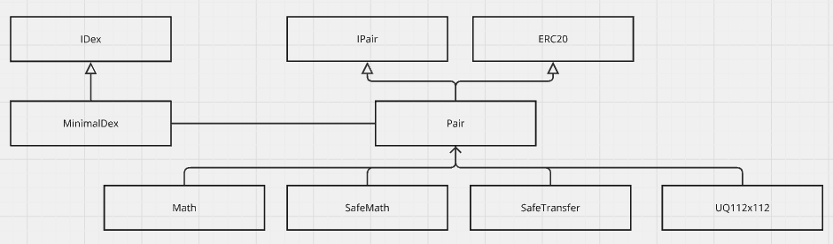
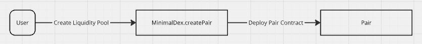
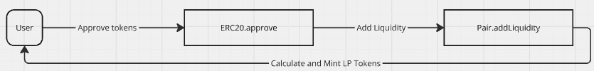
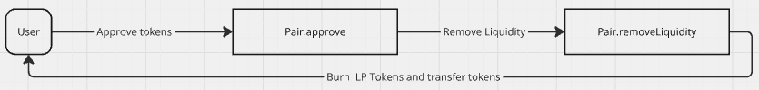
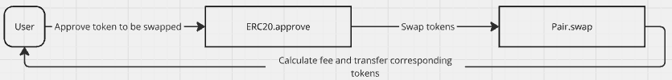

# MinimalDex: A Decentralized Exchange Proof of Concept

This project demonstrates a minimalistic decentralized exchange (DEX) focused on core features such as liquidity provisioning and token swaps. It is intended as a proof of concept, showcasing the use of Foundry and Hardhat Ignition for deployment and testing.

## Features
- Add Liquidity – The system must allow users to provide liquidity.
- Token Swaps – The system must enable token swaps.

## Prequisties
- Node v20 or highter
- Foundry: Installation guide available [here](https://book.getfoundry.sh/getting-started/installation)

## Getting Started

### Using Foundry
#### 1. Building the project
To compile the project, run the following command:
```
forge build
```
#### 2. Testing the contract
To run tests, use: 
```
forge test
```
#### 3. Deploying locally
##### 3.1 Run a Local Blockchain:
Start a local Ethereum network with Anvil.
```
anvil
```
##### 3.2 Deploy to Local Blockchain:
Replace <your_private_key> with the private key provided by Anvil and execute the following command to deploy
```
forge script script/foundry/MinimalDex.s.sol --rpc-url 127.0.0.1:8545 --private-key <your_private_key> --slow --broadcast

```
#### 4. Deploying to Sepolia Testnet
Ensure you have enough balance in your wallet and your etherscan api key in foundry.toml execute the following:
```
forge script script/foundry/MinimalDex.s.sol --rpc-url https://sepolia.gateway.tenderly.co --private-key <your_private_key> --slow --broadcast --verify
```

## Using Hardhat Ignition
### 1. Installing npm packages
```
npm i
```
### 2. Compiling the Contract
```
npx hardhat compile
```

### Running the tests
To execute tests, run:
```
npx hardhat test
``` 
You can also measure gas usage during tests by running:
```
REPORT_GAS=true npx hardhat test
```

### Deploying locally
```
npx hardhat ignition deploy ./ignition/modules/MinimalDex.ts --network hardhat
```

### Deploying to Sepolia Testnet
```
npx hardhat ignition deploy ./ignition/modules/MinimalDex.ts --network sepoliaTestnet
```

## Architecture Diagram
### Contracts Hierachy

### Workflow
- Create a Liquidity Pool
Deploy the Pair Contract using create2 and initialize the Pair Contract

- Adding Liquidity
The liquidity minted is based on the amount of the lesser token relative to the pool’s reserves, ensuring liquidity shares are proportional to the pool’s balance.

- Removing Liquidity
When removing liquidity, the function calculates how much of each token should be returned based on the user’s share of the liquidity pool.

- Swapping tokens
The swap function allows a user to swap token0 for token1, or vice versa, using the reserve0 and reserve1 values.

## Conclusion
This project serves as a foundation for understanding the basic mechanisms of a decentralized exchange, using cutting-edge tools like Foundry and Hardhat Ignition for testing and deployment. Feel free to explore, extend, and experiment with the code!